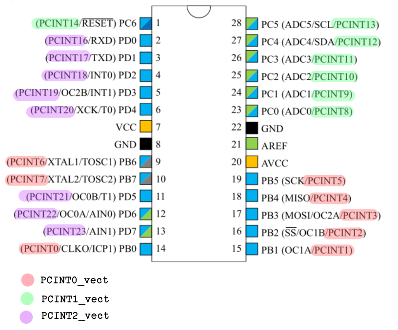
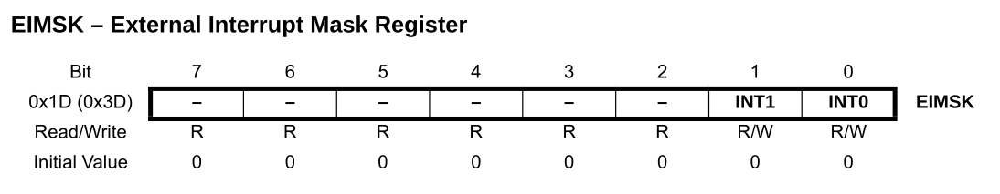
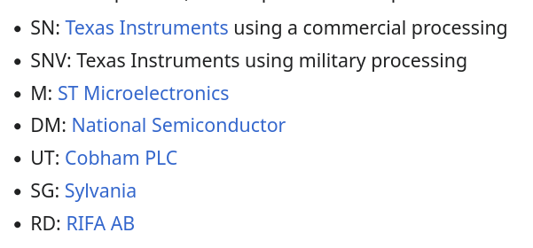

## Table of Contents
1. [Intro](#intro)
2. [Shift Register](#shift-register)
3. [IC SN74HC595](#ic-sn74hc595)  
  a. [↳Overview](#overview)  
  b. [↳Pin Descriptions](#pin-descriptions)  
  c. [↳Functional Characteristics](#functional-characteristics)  
4. [Interrupts](#interrupts)  
  a. [↳A Brief Description](#a-brief-description)  
  b. [↳Blocking Process](#blocking-process)  
  c. [↳Interrupts in ATMega328P](#interrupts-in-atmega328p)  
5. [Putting it All Together](#putting-it-all-together)  
  a. [↳Writing Bytes to the Shift Register](#writing-bytes-to-the-shift-register)  
  b. [↳The Animation](#the-animation)  
  c. [↳Interrupt for Interface](#interrupt-for-interface)  
  d. [↳Result](#result)
6. [Conclusion](#conclusion)
7. [↳Nomenclature of the 7400 series IC (trivia)](#nomenclature-of-the-7400-series-ic-opsional)
8. [References and Further Reading](#references-and-further-reading)
9. [Foot Notes](#foot-notes)

## Overview
Bagaimana caranya menganimasikan 8 LED dengan mikrokontroler? Cara paling sederhana adalah menggunakan 8 pin GPIO dari port yang sama. Contoh, jika kita menggunakan Port B, maka kita perlu mengubah register DDRB sekali dan memanipulasi PORTB untuk setiap frame-nya. Selesai.

Tapi terdapat masalah lain, jumlah pin GPIO pada MCU sangatlah terbatas. Beberapa MCU bahkan hanya memiliki 6 GPIO. Atau, meskipun jumlah pin yang dimiliki melimpah, kita tidak tahu pada update versi selanjutnya akan membutuhkan berapa banyak pin.

Salah satu solusi yang dapat digunakan adalah IC Shift Register Serial In Parallel Out, yang akan kita gunakan adalah IC SN74HC595. Sementara IC tersebut menangani 8 LED, digunakan 3 tombol sebagai interface: previous, restart, dan next. Interrupt akan mendeteksi ketika salah satu tombol ditekan. Itulah yang akan kita bahas kali ini.

Sebenarnya, ATMega328P memiliki pin yang cukup untuk menangani 8 LED dengan port yang sama. _But, let's do it anyway_.

_Catatan: Blog ini tidak ditujukan sebagai tutorial atau blog singkat, melainkan 'technical walkthrough' tentang program yang saya buat. Itulah mengapa blog ini cukup panjang._
## Shift Register
Kata "register" pada shift register secara konsep sama saja seperti register yang ada pada MCU. Register is register. Yang membedakan adalah kata "shift" (geser). Jadi, shift register adalah salah satu jenis register yang bisa menggeser data di dalamnya dari bit 0 ke bit 1, bit 1 ke bit 2, dan seterusnya ketika diberi sinyal clock.

Di dalam MCU juga terdapat internal shift register, tapi kali ini kita hanya membahas tentang external shift register dalam bentuk Integrated Circuit (IC). Karena ini eksternal, satu-satunya cara untuk memanipulasi register adalah dengan mengirimkan sinyal elektrik HIGH dan LOW. Alih-alih melakukan assignment seperti `PORTB = 0x3F;` pada program MCU.

Terdapat dua jenis shift register: Serial In Parallel Out (SIPO), dan Parallel In Serial Out (PISO). Yang akan kita gunakan adalah SIPO karena kita ingin mengurangi penggunaan pin MCU.

_Catatan: Mulai sekarang sampai blog ini selesai, SR berarti Shift Register. Perlu diingat bahwa terdapat makna lain dari SR._

## IC SN74HC595
### Overview

74HC595 adalah Integrated Circuit yang berguna untuk mengubah input serial menjadi output paralel (SIPO) dengan kapasitas maksimal 8-bit. Di dalamnya, terdapat dua macam register:
* shift register berguna sebagai "antrean" data masuk,
* storage register (disebut juga latch) berguna untuk menyimpan data dari shift register dan diteruskan ke pin output. Data shift register hanya akan disimpan jika pin RCLK (disebut juga latch) diberi perubahan sinyal dari LOW ke HIGH.

### Pin Descriptions
. Perlu dicatat bahwa garis di atas pin OE dan RCLK memiliki Acrive Low, pin tersebut akan aktif jika dihubungkan ke ground.")
|Pin Number|Pin Name|Description|
|:--|:--|:--|
|15,1-7|Qa-Qh|Parallel Output, diambil dari storage register.|
|8|GND|Ground Pin.|
|9|Qh'|Serial Output untuk merangkai 2 shift register atau lebih (kita abaikan di blog ini).|
|10|SRCLR|Shift Register Clear, aktif ketika terhubung ground.|
|11|SRCLK|Shift Register Clock, akan menggeser data di dalam shift register jika pin ini diberi sinyal dari LOW ke HIGH (rising edge).|
|12|RCLK|Register Clock, saat diberi rising edge data shift register akan disalin ke storage register, sehingga mengubah output.|
|13|OE|Output Enable, aktif ketika terhubung ke ground| 
|14|SER|Serial data, jalur masuk data serial.|
|16|VCC|Suplai tegangan dari -0.5V sampai dengan 7V.|

### Functional Characteristics


Untuk memahami tabel di atas, berikut beberapa penjelasan untuk masing-masing jenis input:
* X: Don't care, tidak peduli input yang diberikan,
* H: HIGH,
* L: Low,
* ↑: Rising edge, ketika sinyal berubah dari LOW ke HIGH.

Pada tabel fungsi, perubahan data dipicu oleh sinyal clock. Yang diperhatikan bukan sinyal HIGH atau LOW, tetapi transisi dari LOW ke HIGH (rising edge). 

Berikut adalah penjelasan masing-masing mode:
* Fungsi 1 dan 2, untuk mengaktifkan pin output (Qa-Qh), pin OE harus disambungkan ke ground.  
* Fungsi 3, kita perlu menghubungkan pin SRCLR ke VCC agar SR tidak di-clear.  
* Fungsi 4, ketika SER bernilai LOW, SRCLR HIGH, dan memberi SRCLK sinyal clock: SR akan bergeser dan bit pertama bernilai 0.
* Fungsi 5, Sama seperti sebelumnya, namun SER bernilai HIGH sehingga SR bergeser dan bit pertama bernilai 1.  
* Fungsi 6, ketika RCLK diberi sinyal clock (rising edge), data di dalam SR akan disalin ke storage register.

Jadi, koneksi ke MCU yang perlu ditentukan adalah untuk pin SER, SRCLK, dan RCLK. Sedangkan untuk pin output, masing-masing pin dihubungkan ke katoda LED. Untuk pin lain, OE dihubungkan ke ground, dan SRCLR dihubungkan ke VCC.

## Interrupts
### A Brief Description
Interrupt adalah salah satu fungs dasar pada mikrokontroler yang berguna untuk menginterupsi program utama untuk melakukan proses lain yang lebih penting. Secara teknis, interrupt adalah sinyal yang menginformasikan CPU agar menghentikan apapun yang sedang dilakukan untuk sementara waktu. Setelah itu, Interrupt Service Routine (ISR) akan dijalankan. ISR umumnya ditulis dalam bentuk routine/fungsi. Kemudian, CPU kembali melanjutkan proses yang sebelumnya diinterupsi.

### Blocking Process
Perlu diingat bahwa sebuah CPU hanya bisa melakukan satu tugas  dalam satu waktu. Sementara itu, proses seperti animasi LED adalah proses yang memakan waktu, sebagian besar waktunya digunakan untuk menunggu beberapa ratus ms agar kita dapat melihat animasinya. Inilah yang disebut blocking process.

Misalkan kita menambahkan tombol 'previous', 'next', dan 'restart' yang berguna untuk mengontrol animasi mana yang diputar. Tanpa interrupt, jika salah satu tombol ditekan maka tombol itu diabakan selama animasi sedang berjalan.

Dengan interrupt, kita bisa menginterupsi di tengah-tengah proses animasi. Kemudian di dalam ISR, ditentukan animasi mana yang harus diputar selanjutnya. Setelah itu, ISR kembali ke proses yang diinterupsi. Bedanya, kali ini fungsi tersebut dihentikan paksa sehingga iterasi main loop juga akan dihentikan paksa.

### Interrupts in ATMega328P
Pada ATMega328P terdapat beberapa macam interrupt, masing-masing memiliki alamat ISR-nya sendiri. 


Sebagai contoh, ketika tombol dengan konfigurasi pull-up resistor ditekan, kondisi pin terkait akan berubah. Maka, untuk menerapkan interrupt, digunakan jenis Pin Change Interrupt (PCINT). Terdapat 3 PCINT (PCINT0-PCINT2), PCINT0 serta PCINT 2 masing-masing menangani 8 pin, dan PCINT1 menangani 7 pin.

Untuk menggunakan fitur interrupt, sertakan library `<avr/interrupt.h>`. Secara default interrupt tidak aktif, untuk mengaktifkan interrupt global, pangggil fungsi `sei()`. Selanjutnya, untuk mengaktifkan interrupt vector spesifik, register interrupt terkait perlu dimanipulasi.


```c
EIMSK |= (1 << INT1);
sei();
```
Ekspresi di atas akan memodifikasi EIMSK (External Interrupt Mask Register), mengubah 0 menjadi 1 pada bit INT1. Sehingga interrupt vector INT1 menjadi aktif. Pemanggilan fungsi `sei()` akan mengaktifkan interrupt secara global. 

Ketika terdapat sinyal interrupt INT1 diciptakan, MCU akan segera menjalankan ISR yang sudah didefinisikan:
```c
ISR (INT1_vect) {
  // isr tasks
}
```
ISR dapat diinterupsi oleh interrupt vector yang memiliki prioritas lebih tinggi. Contoh, INT1 dapat diinterupsi oleh INT0 dan RESET.

Proses di dalam ISR sebaiknya dibuat seringkas mungkin. Salah satu cara untuk mempersingkatnya adalah menggunakan variable sebagai flag. Ketika sinyal interrupt diberikan, ISR mengisi flag dengan nilai `true`. Flag tersebut akan dievaluasi menggunakan control-flow sebelum mengeksekusi suatu proses.
## Putting it All Together
### Writing Bytes to the Shift Register
Sebuah LED dapat direpresentasikan sebagai satu bit, delapan LED direpresentasikan menjadi delapan bit atau satu byte. Delapan LED tersebut selanjutnya dihubungkan ke output parallel IC shift register, SN74HC595. Sekarang, kita perlu mencari cara untuk mengirimkan data secara serial ke dalam IC tersebut.

Dengan mengabaikan pin-pin output dan pin lain yang terhubung ke ground atau VCC, berikut adalah pin yang tersisa dan perlu dihubungkan ke ATMega328P:
1. SRCLK (11) ke PD0 (2),
2. RCLK (12) ke PD1 (3), dan
3. SER (14) ke PD2 (4).

Pin-pin di atas digunakan dalam fungsi-fungsi primer yang melakukan: bit shifting, trigger SR clock, latch SR ke output.

_*Catatan: Nomor pin SN74HC595 mengacu package DIP-16, dan ATMega328P DIP-28_
```c
// shiftreg.c
#define SER PD0
#define R_CLK PD1
#define SR_CLK PD2

void tick(void) {
  PORTD |= (1 << SR_CLK);
  _delay_ms(1);
  PORTD &= (~(1 << SR_CLK));
}
```
Ketika routine `tick()` dieksekusi, data shift register akan digeser dengan nilai bit ke-0 mengikuti nilai `SER` atau `PD0` pada saat fungsi dieksekusi. Hal ini sesuai dengan karakteristik SR pada datasheet yang [sudah kita bahas](#functional-characteristics).
```c
// shiftreg.c
void shift_bit(bool bit) {
  if (bit)    PORTD |= (1 << SER);
  else        PORTD &= (~(1 << SER));

  tick();
}
```
Fungsi `shift_bit(bool bit)` menerima boolean sebagai parameter. Boolean tersebut dijadikan sebagai nilai `PD0`. Setelah nilai `PD0` diubah, fungsi `tick()` dipanggil sehingga bit ke-0 pada SR ditentukan oleh parameter `bit`.
```c
// shiftreg.c
bool latch(void) {
  PORTD |= (1 << R_CLK);
  _delay_ms(1);
  PORTD &= (~(1 << R_CLK));

  if (restart_requested) {
    restart_requested = false;
    return false;
  }
  return true;
}
```

Fungsi `latch()` akan menyalakan `R_CLK` atau `PD1` selama 1ms. Sesuai datasheet, high pada `RCLK` akan menyalin data pada SR ke storage register yang menyimpan nilai output.

Selanjutnya, `restart_requested` yang merupakan variable flag akan diperiksa. Jika bernilai `true`, flag tersebut akan dikembalikan ke nilai defaultnya. Setelah itu menghentikan eksekusi fungsi `latch()` dengan `return false;`.

Proses serupa terjadi secara bertumpuk/bersarang, fungsi yang memanggil `latch()` dan mendapatkan nilai `false` akan mengakhiri dirinya dengan mengembalikan nilai `false`. Dan seterusnya.

Sehingga ketika sinyal interrupt diberikan, semua proses secara instan akan terhenti dan memulai ulang _main-loop_ untuk memulai animasi sebelumnya, selanjutnya, atau memulai ulang animasi saat ini.

```c
// shiftreg.c
bool sr_write(uint8_t data) {
  for (int i=0; i<8; i++) {
    shift_bit(data & 0x80);
    data <<= 1;
  }
  return latch();
}
```
Fungsi `sr_write(uint8_t data)` menerima parameter `data` yang berukuran 8-bit. Fungsi tersebut memasukkan data bit-demi-bit ke dalam SR dimulai dari _Most Significant Bit_ (MSB First).

Di dalam setiap iterasi for, bit paling kiri (`data & 0x80`) dimasukkan ke dalam SR. Selanjutnya, variabel `data` akan digeser 1 posisi ke kiri.

Setelah semua bit dimasukkan ke dalam SR, fungsi `latch()` dipanggil.
### The Animation
Tiga fungsi yang telah dibuat, pada akhirnya digunakan untuk menyala-matikan 8 LED yang terhubung ke IC SR.

Untuk menampilkan animasi, kita perlu memanipulasi SR untuk menampilkan frame selama beberapa ms, kemudian menampilkan frame selanjutnya. Satu frame direpresentasikan oleh `uint8_t`, masing-masing bitnya menentukan nyala-mati satu buah LED.

```c
// anim.c
#include <util/delay.h>
#include <anim.h>

bool draw_pattern(uint8_t pattern, int delay_ms) {
  if (!sr_write(pattern)) return false;
  for (int i = 0; i < delay_ms; i++) {
    _delay_ms(1);
  }
  return true;
}
```

Fungsi `draw_pattern(uint8_t pattern, int delay_ms)` menampilkan `pattern` setidaknya selama `delay_ms`. 

Perlu diingat bahwa fungsi `_delay_ms(int)` hanya menerima bilangan konstan. Untuk mengakalinya, digunakan `for` loop dengan iterasi sebanyak `delay_ms`, di mana setiap iterasinya melakukan delay selama 1ms.

```c
// anim.c
void binary_counter() {
  for (int i=0; i<256; i++) {
    if (!draw_pattern(i, 30)) return;
  }
}
```
Fungsi `binary_conter()` akan melakukan iterasi dari 0-255, nilai biner dari pencacah `i` kemudian ditampilkan selama 30ms.

 melalui CLI.")

```c
// anim.c
void bounce_left_right() {
  for (int i=0; i<8; i++) {
    if (!draw_pattern((1 << i), 80)) return;
  }
  for (int i=7; i>=0; i--) { 
    if (!draw_pattern((1<<i), 80)) return;
  }
}
```
Selain menggunakan nilai biner dari suatu bilangan, operasi bitwise juga dapat digunakan untuk melakukan animasi. Fungsi `bounce_left_right()` menampilkan "bola" yang memantul dari kanan ke kiri dan sebaliknya.

 melalui CLI.")

```c
// anim.c
void left_sign(int len) {
  for (int i=0; i<8; i++) {
    if (i<len) {
      shift_bit(1);
    } else {
      shift_bit(0);
    }
    if (!latch()) return;
    _delay_ms(150);
  }
}
```
Routine `left_sign(int len)`, alih-alih memanggil fungsi seperti `sr_write` atau `draw_pattern`, ia menggunakan fungsi yang lebih dasar. `shift_bit` dan `latch`.

Routine di atas akan melakukan bit shifting bernilai 1 sebanyak `len` kali, dan 0 sebanyak `8-len` kali. Animasi yang dihasilkan adalah LED sejumlah `len` bergeser ke kiri seperti lampu sign kendaraan.

 melalui CLI.")

```c
// anim.h
#include <stdint.h>
bool draw_pattern(uint8_t pattern, int delay);
void hello_world();
void binary_counter();
void stack_to_end();
void bounce_left_right();
void left_sign(int);
void loading_bar();
void random_spark();
void waterdrop();
void heartbeat();
```

File header di atas mendefinisikan fungsi-fungsi animasi. File tersebut akan disertakan pada `anim.c` dan `shiftreg.c`. Program lengkap dapat ditemukan di [repo github berikut](https://github.com/vfadlan/avr-exp/05-shiftreg/).

### Interrupt for Interface

```c
// shiftreg.c
#include <avr/io.h>
#include <avr/interrupt.h>
#include <util/delay.h>
#include <stdbool.h>
#include <stdint.h>
#include <stdlib.h>

#define F_CPU 16000000UL

#define SER PD0
#define R_CLK PD1
#define SR_CLK PD2
#define ANIM_NUM 9

bool sr_write(uint8_t data);
void shift_bit(bool bit);
void tick(void);
bool latch(void);

#include <anim.h>

volatile bool restart_requested = false;
volatile int mode = 0;

int main(void) {
  DDRD |= (1 << SER) | (1 << R_CLK) | (1 << SR_CLK); // three output pins
  PORTD |= (1 << PD5) | (1 << PD6) | (1 << PD7);  // three pull-up button interface
  PCICR |= (1 << PCIE2); // enable PCINT2
  PCMSK2 |= (1 << PCINT21) | (1 << PCINT22) | (1 << PCINT23); // enable PCINT2 for three pins

  ADCSRA |= (1 << ADEN);
  ADMUX = 0x00;
  ADCSRA |= (1 << ADSC);
  while(ADCSRA & (1 << ADSC));
  srand(ADC); // seed PRNG with ADC noise
  
  sei(); // enable global interrupt

  while (true) {
    switch (mode) {
      case 0:
        hello_world();
        break;
      case 1:
        binary_counter();
        break;
      case 2:
        bounce_left_right();
        break;
      case 3:
        left_sign(3);
        break;
      case 4:
        stack_to_end();
        break;
      case 5:
        loading_bar();
        break;
      case 6:
        random_spark();
        break;
      case 7:
        waterdrop();
        break;
      case 8:
        heartbeat();
        break;
      default:
        hello_world();
        break;
    }
  }
}
```

File `shiftreg.c` adalah file utama program ini. Terdapat variable global volatile `restart_requested` sebagai flag interrupt, dan `mode` menentukan animasi mana yang perlu diputar.

Variabel `mode` bertipe data integer dengan nilai maksimal adalah `ANIM_NUM - 1` yang menyatakan banyaknya animasi yang tersedia.

Untuk mengubah animasi yang diputar, digunakan tiga tombol interface: previous, restart, next. Karena animasi merupakan proses blocking, digunakan interruptuntuk mendeteksi aksi pada tombol.

```c
PORTD |= (1 << PD5) | (1 << PD6) | (1 << PD7);  // three pull-up button interface
PCICR |= (1 << PCIE2); // enable PCINT2
PCMSK2 |= (1 << PCINT21) | (1 << PCINT22) | (1 << PCINT23); // enable PCINT2 for three pins
```

Pada baris pertama, sinyal `PD5`, `PD6`, dan `PD7` diatur menjadi HIGH. Masing-masing pin tersebut dihubungkan ke Vcc. Ketika tombol ditekan, pin akan dialirkan ke ground sehingga nilai pin terkait berubah menjadi LOW. Ini disebut pull-up button. 


Pada baris kedua Pin Change Interrupt kedua diaktifkan. Baris selanjutnya, `PCMSK2` (Pin Change Mask 2) dimanipulasi sehingga PCINT21 (PD5), PCINT22, (PD6), PCINT23 (PD7) dapat mengirimkan sinyal interrupt ketika terjadi perubahan sinyal.

```c
ISR (PCINT2_vect) {
  _delay_ms(25);
  restart_requested = true;

  if ((~(PIND >> PD5)) & 1) {
    if (mode) {
      mode--;
    } else {
      mode = ANIM_NUM-1;
    }

  } else if ((~(PIND >> PD7)) & 1) {
    if (mode==(ANIM_NUM-1)) {
      mode = 0;
    } else {
      mode++;
    }
  }
}
```

ISR di atas menangani tiga tombol interface. Saat ISR pertama kali dijalankan, MCU perlu menunggu 25ms untuk mengabaikan bouncing signal.

Ketika tombol mekanik ditekan, kontak yang dihasilkan tidak langsung sempurna. Alih-alih, terjadi fluktuasi seperti gambar di atas. Fluktuasi di atas disebut bouncing signal.

Terdapat beberapa teknik untuk _debouncing_ (mengurangi sinyal fluktuasi). Dapat menggunakan solusi hardware maupun software. Solusi sederhana dengan software adalah menunggu selama beberapa ms sampai sinyal tersebut stabil, seperti yang dilakukan `_delay_ms(25)`*.

Setelah debouncing, `restart_requested` diubah menjadi `true` sehingga semua fungsi `latch()` dan yang memanggilnya akan terhenti begitu ISR selesai dijalankan.

Selanjutnya, blok control-flow mengevaluasi jika tombol yang ditekan terhubung dengan `PD5` (tombol previous). Jika benar,  nilai mode akan dikurangi 1, atau kembali ke nilai `ANIM_NUM-1` sehingga `mode` tidak akan bernilai negatif.

Jika salah, else if akan memeriksa jika tombol yang ditekan terhubung dengan `PD7` (tombol next). Jika benar, nilai mode akan diubah ditambah 1, atau kembali ke 0 sehingga `mode` akan selalu lebih kecil dari `ANIM_NUM`.

_*Catatan: penggunaan delay di dalam ISR sangat tidak direkomendasikan karena merupakan proses blocking. Sebaiknya gunakan timer interrupt. Namun kali ini kita gunakan delay, penggunaan timer akan dibahas di blog selanjutnya._
### Result
```
youtube video here
```

## Conclusion
Sekedar kilas balik, kita sudah membahas tentang shift register, karakteristik ic sn74hc595, interrupts, dan program c. 


Gambar di atas adalah diagram rangkaian secara keseluruhan. Kode program tersedia di repo [repo github](https://github.com/vfadlan/avr-exp/05-shiftreg/).

Pada technical blog selanjutnya, kita akan mencoba menampilkan sesuatu ke 7-segment display dan 8x8 matrix sekaligus menggunakan 2 buah ic driver yang disusun berantai, max7219.

## Nomenclature of the 7400 series IC (trivia)
IC 74HC595 memiliki makna dalam penamaannya. Untuk deskripsi lebih detail Anda dapat meninjau laman Wikipedia berikut: [7400-series Integrated Circuits](https://en.wikipedia.org/wiki/7400-series_integrated_circuits). Berikut adalah ringkasannya:
* Kode 74 di depan merepresentasikan temperatur operasinya: 
* HC adalah singkatan dari Highspeed CMOS, ini adalah kode family line. Terdapat banyak family line lain seperti L (Low Power), C (CMOS), F (Fast), dan masih banyak lagi. Untuk lebih detailnya silakan baca [di sini](https://en.wikipedia.org/wiki/7400-series_integrated_circuits#Families).
* Sedangkan 595 adalah kode subfamily. Banyak subfamily lain seperti 165 (SIPO SR), 00 (Quad AND Gate), 114 (Dual J-K Flip-Flop), dsb.

IC 7400 series ini didesain oleh perusahaan asal Amerika, Texas Instruments. Namun, perusahaan lain memiliki lisensi untuk memproduksi seri ini. Sehingga, diberikan prefiks untuk memberi keterangan perusahaan yang memproduksinya: 

## References and Further Reading
* GitHub: [vfadlan/avr-exp/05-shiftreg](https://github.com/vfadlan/avr-exp/tree/main/05-shiftreg)
* [ATMega328P Datasheet](https://ww1.microchip.com/downloads/en/DeviceDoc/Atmel-7810-Automotive-Microcontrollers-ATmega328P_Datasheet.pdf)
* [SNx4HC595 Datasheet](https://www.ti.com/lit/ds/symlink/sn74hc595.pdf)
* The C Programming Language (2nd Edition) by Brian Kernighan and Dennis Ritchie
* [TI Application Note: Designing with Shift Registers](https://www.ti.com/lit/an/scea117/scea117.pdf)
* [Switch Debouncing, Article from circuitcellar.com](https://circuitcellar.com/resources/quickbits/switch-debouncing/)
* [7400-Series Integrated Circuit, Article from wikipedia.org](https://en.wikipedia.org/wiki/7400-series_integrated_circuits)