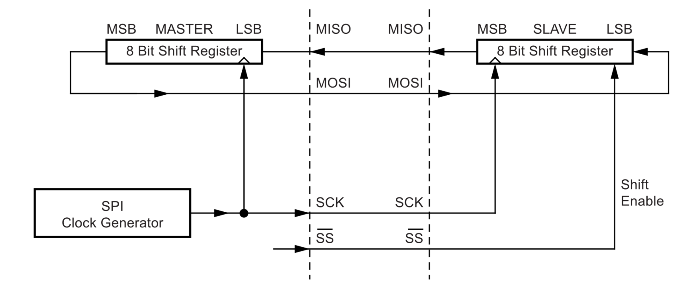
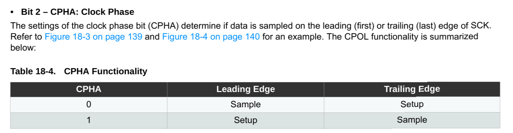
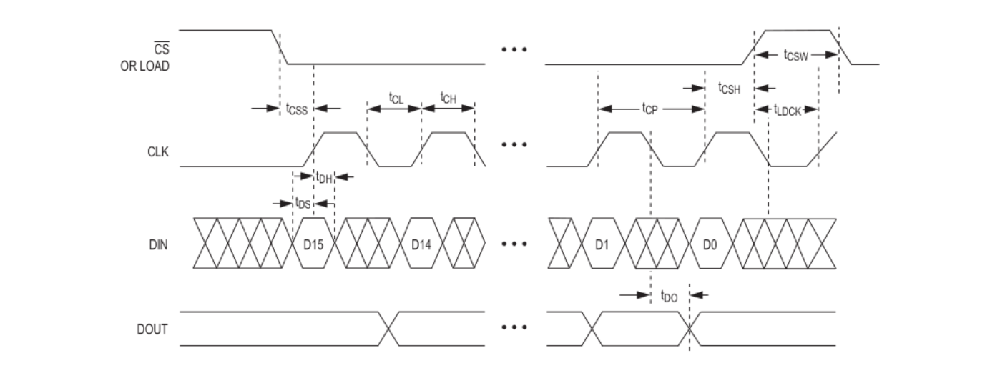
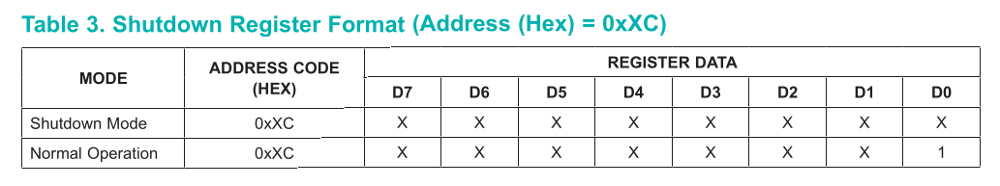
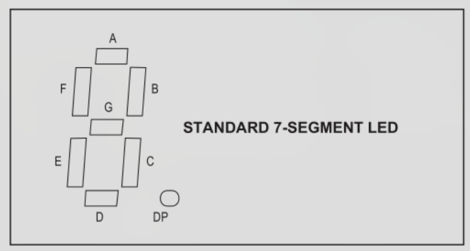
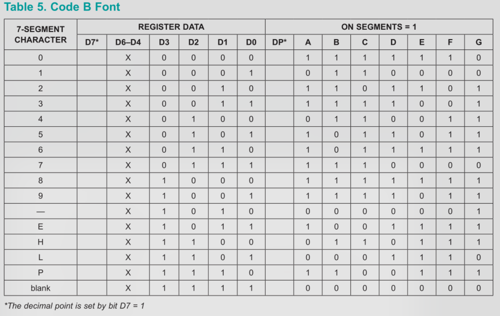

## Table of Contents
1. [Intro - Objective](#intro---objective)
2. [Timer](#timer)  
a. [↳ Do The Math](#do-the-math)  
b. [↳ Registers](#registers)  
c. [↳ Button Debouncing](#button-debouncing)  
3. [MAX7219 LED Display Driver](#max7219-led-display-driver)  
a. [↳ Overview](#overview)  
b. [↳ Serial Peripheral Interface (SPI) Protocol](#serial-peripheral-interface-spi-protocol)  
c. [↳ Registers Map](#registers-map)  
d. [↳ Daisy Chaining](#daisy-chaining)
4. [Show Something](#show-something)  
a. [↳ 8 Digit 7-Segment LED](#8-digit-7-segment-led)  
b. [↳ 8x8 LED Matrix](#8x8-led-matrix)
4. [Result](#result)
5. [Conclusion](#conclusion)
6. [References and Further Reading](#references-and-further-reading)

## Intro - Objective

Pada blog teknikal kali kini, kita akan mencoba menjadikan mikrokontroler ATMega328P sebagai otak dari jam digital. Jam digital akan ditampilkan dalam format 8 digit: `HH.MM.SS.cc` dengan `c` adalah _centiseconds_.

Untuk menampilkan waktu, digunakan modul display 7 segment dengan MAX7219 sebagai drivernya. Selain itu, digunakan pula display matrix 8x8 dengan driver yang sama untuk tantangan semata.

Matrix 8x8 akan menampilkan beberapa emoji/karakter, angka, huruf kapital, dan huruf kecil. Untuk mengganti tampilan, digunakan dua tombol: prev dan next.

Pada jam digital, ditambahkan mekanisme "hold" yang akan menghentikan waktu (display) selama tombol masih ditekan.

Program akan dibahas secara runtut dari program utama timer, debouncing button, hingga interface MAX7219. Kita akan menggunakan beberapa konsep C seperti pointers, reference, dan struct, pastikan Anda telah memahaminya.

## Timer

Secara umum, timer adalah periferal pada mikrokontroler yang berguna untuk menghitung sinyal clock. Timer dSecara umum, timer adalah periferal pada mikrokontroler yang berguna untuk menghitung sinyal clock. Timer dapat dikonfigurasi sedemikian rupa, sehingga perhitungannya dapat digunakan untuk mengukur waktu, delay, dan lain lain.
apat dikonfigurasi sedemikian rupa, sehingga perhitungannya dapat digunakan untuk mengukur waktu, delay, dan lain lain.

Timer bekerja dengan melakukan increment/decrement nilai register setiap beberapa interval. Batas bilangan dan interval dapat dikonfigurasi.

Mikrokontroler ATMega328P dibekali dengan tiga buah timer: timer0 8-bit, timer1 16-bit, dan timer2 8-bit. Kita akan menggunakan timer1 16-bit untuk mengukur waktu dan melakukan button debouncing.

Timer ini memiliki beberapa mode utama: normal, pwm (pulse width modulation), ctc (clear timer compare match). Pada mode ini, timer akan melakukan increment pada register `TCNT1H` dan `TCNT1L`*. Kemudian membandingkan nilai kedua register tersebut dengan register pembanding yang kita konfigurasi.

Ketika nilainya cocok (match), register `TCINT1H` dan `TCINT1L` akan direset ke nilai 0. Jika kita mengaktifkan interrupt, ISR akan dijalankan.

_*Catatan: `TCNTH` untuk byte 8-15 dan `TCNT1L` untuk byte 0-7._

### Do The Math

Unit waktu terkecil pada jam yang akan dibuat adalah 1 centisecond:

$$
  1\text{ s} = 100\text{ cs} = 1,000\text{ ms} = 1,000,000\text{ μs} = 1,000,000,000\text{ ns}
$$

Unit `centiseconds` dijadikan sebagai variable global volatile yang nilainya diincrement setiap 10ms oleh ISR timer 1. Kita perlu mengkonfigurasi timer1 untuk menjalankan ISR setiap 10ms. Sebelum itu, kita hitung terlebih dahulu berapa lama durasi 1 clock cycle.

$$
f_{CPU} = 16\text{ MHz} = 16,000,000\text{ clock cycles/s}
$$
$$
T = \frac{1,000,000,000\text{ ns}}{16,000,000\text { ticks}} = 62.5\text{ ns/cycle}
$$
$$
\frac{10\text{ ms}}{62.5\text{ ns}} = \frac{10,000,000\text{ ns}}{62.5\text{ ns}} = 160,000\text{ clock cycles}
$$


Butuh 160.000 clock cycle untuk mencapai durasi 10ms jika frekuensi yang digunakan adalah 16MHz. Angka ini terlalu besar untuk timer1 yang hanya 16-bit, \(2^{16} = 65,536\).

Untuk mengatur frekuensi timer ATMega328P, dapat diterapkan sebuah prescale. Yakni membagi frekuensi CPU dengan suatu bilangan. Pada timer 1, frekuensi dapat dibagi dengan \(1, 8, 64, 256,\) atau \(1,024\). 

Perlu diingat bahwa prescale pada timer tidak akan memengaruhi frekuensi utama CPU. Untuk kejelasan, `tick` merepresentasikan 1 clock cycle pada timer, bukan frekuensi utama CPU.


$$
\frac{16\text{ MHz}}{8} = 2\text{ MHz} = 2,000,000\text{ ticks/s} = \frac{2,000,000\text{ ticks}}{1,000,000,000\text{ ns}}
$$
$$
T_{tick} = \frac{1,000,000,000\text{ ns}}{2,000,000\text { ticks}} = 500\text{ ns}
$$
$$
\frac{10\text{ ms}}{500\text{ ns}} = \frac{10,000,000\text{ ns}}{500\text{ ns}} = 20,000\text{ ticks}
$$

Sekarang kita tahu bahwa untuk mencapai 10ms dibutuhkan 20.000 tick timer1, jika frekuensi timer1 dibagi 8. 19.999 (hitung dari 0) akan menjadi nilai pembanding timer1 untuk menjalankan ISR, sehingga ISR dijalankan setiap 10ms.

### Registers


```c
TCCR1B = (1 << 3) | 0b010;
```
`(1 << 3)` akan mengaktifkan mode CTC dengan nilai `OCR1A` sebagai nilai pembanding (Table 15-5). Dan `| 0b010` akan mengaktifkan prescale 8 (Table 15-6).

Setelah timer 1 dikonfigurasi, kita masih perlu membandingkan nilai `TCINT1` dengan `19999`.


`OCR1A` atau `OCR1B` cocok dengan kebutuhan kita. Untuk mengaktifkan interrupt ketika nilai `OCR1A` dan `TCINT1` cocok, register `TIMSK` harus diubah.


```c
int main()
{
  // ...
  TCCR1B = (1 << 3) | 0b010; // ctc mode, presale 8 (2 MHz)
  OCR1A = 19999; // 10ms each match
  TIMSK1 |= (1 << OCIE1A); // Enable compare match A interrupt
  // ...
}
```

Dengan konfigurasi timer di atas, sinyal interrupt vector TIMER1_COMPA akan dihasilkan setiap 10ms. Di dalam ISR kita dapat melakukan increment variabel `centiseconds`, dan mengaktifkan flag `update_display`.

Flag `update_display` digunakan agar driver tidak terlalu banyak bekerja. Frekuensi maksimal yang dapat ditanggung IC `MAX7219` adalah 800Hz. Dengan update setiap 10ms, maka frekuensinya adalah 100Hz. 
```c
volatile uint32_t centiseconds = 0;
volatile bool count = true;
volatile bool update_display = true;

ISR (TIMER1_COMPA_vect) 
{
  if (count) {
    centiseconds++;
    update_display = true;
  }
  // ...
}
```

Variabel boolean `count` ditentukan oleh sebuah tombol, ketika ditahan nilainya false. Terdapat dua tombol lain `prev` dan `next`, yang  berfungsi untuk mengganti tampilan matrix 8x8.

Alih-alih menggunakan PCINT (Pin Change Interrupt) atau EINT (External Interrupt), kita akan menggunakan ISR yang sudah ada.
### Button Debouncing

Pada program sebelumnya, kita menggunakan `_delay_ms(25)` di dalam ISR untuk melakukan debouncing pada sebuah tombol. Namun, ISR harus diselesaikan dalam clock cycle seminimal mungkin. Fungsi delay melanggar aturan tersebut.

> Generally it is never recommended to use a delay routine inside the
ISR. ~AVR1200: Using External Interrupts for megaAVR
Devices, ATMEL Application Notes

Sebagai alternatif, kita dapat menggunakan ISR timer yang sudah kita buat untuk mengecek keadaan tiga tombol setiap 10ms. 

```c
#define BUTTON_COUNT 3

typedef struct 
{
  uint8_t *inputreg;
  uint8_t pin_no;
  bool last_state;
  uint8_t delay;
  bool event;
} button_t;

volatile button_t hold; // PD2
volatile button_t next; // PD6
volatile button_t prev; // PD7

volatile button_t *buttons[BUTTON_COUNT] = {
  &hold,
  &next,
  &prev
};

button_t init_button(uint8_t *inputreg, char pin_no)
{
  button_t temp;
  temp.inputreg = inputreg;
  temp.pin_no = pin_no;
  temp.last_state = ((*inputreg) >> pin_no) & 1;
  temp.delay = 0;
  temp.event = false;
  return temp;
}
```

Karena ketiga tombol memiliki karakteristik/parameter yang sama, kita dapat memanfaatkan struct. 

Array `*buttons` akan diiterasi di dalam ISR. Masing-masing elemen array tersebut menunjuk ke alamat memori sebuah struct `button_t`.

```c
int main()
{
  //...
  hold = init_button(&PIND, PD2);
  next = init_button(&PIND, PD6);
  prev = init_button(&PIND, PD7);

  PORTD = (1 << hold.pin_no) | (1 << next.pin_no) | (1 << prev.pin_no);
  //...
}
```
Pemanggilan fungsi `init_button` di dalam main akan menginisialisasi struct `button_t`. Ketiga tombol di atas merupakan pull-up button, sehingga nilai `last_state` adalah 1, dan kita perlu memberi nilai HIGH pada `PORTD`.

Karena alamat ketiga variabel di atas disimpan dalam sebuah array, kita dapat menggunakan `for` loop di dalam ISR untuk mengecek keadaan setiap tombol:
```c
#define DEBOUNCE_DELAY 3
ISR (TIMER1_COMPA_vect) 
{
  if (count) {
    centiseconds++;
    update_display = true;
  }

  for (int i=0; i<BUTTON_COUNT; i++) {
    bool current_state = (*(buttons[i]->inputreg) >> buttons[i]->pin_no) & 1;

    if (current_state != buttons[i]->last_state) {
      if (buttons[i]->delay>=DEBOUNCE_DELAY) {
        buttons[i]->event = true;
        buttons[i]->last_state = current_state;
        buttons[i]->delay = 0;
      } else {
        buttons[i]->delay++;
      }
      update_display = true;
    } else {
      buttons[i]->delay = 0;
    }
  }
}
```
Di setiap iterasinya, jika kondisi tombol saat ini berbeda dengan kondisi terakhir, nilai member `delay` akan di-increment. Ini akan terjadi sebanyak tiga kali setiap ISR dijalankan, yakni setiap 10ms.
Dengan begitu, durasi total debounce adalah 30ms.

Setelah nilai `delay` >= 3, flag `event` akan diaktifkan, keadaan terakhir diperbarui, dan `delay` diulang ke 0. Flag `event` nantinya digunakan pada _main loop_ untuk menjalankan aksi yang diperlukan.

```c
extern uint8_t IMAGES_LEN;
volatile int c = 0;

int main() 
{
  // ...
  while (1) {
    // ...
    if (hold.event) {
      if ((*(hold.inputreg) >> hold.pin_no) & 1) {
        count = true;
      } else {
        count = false;
      }
      hold.event = false;
    }

    if (next.event) {
      if (!((*(next.inputreg) >> next.pin_no) & 1)) {
        if (c==(IMAGES_LEN-1)) {
          c = 0;
        } else {
          c++;
        }
      }
      next.event = false;
    }

    if (prev.event) {
      if (!((*(prev.inputreg) >> prev.pin_no) & 1)) {
        if (c) {
          c--;
        } else {
          c = IMAGES_LEN-1;
        }
      }
      prev.event = false;
    }
  }
}
```
Tidak lupa, setelah aksi, member `event` dikembalikan ke nilai `false`.

Sistem debounce di atas tidak menggunakan fungsi _blocking_ `_delay_ms` yang akan memblokir semua proses dalam periode tertentu. Alih-alih, ISR timer yang sudah dikonfigurasi digunakan untuk mengecek keadaan masing-masing tombol dan melakukan delay _non-blocking_. Karena merupakan proses _non-blocking_, display waktu tidak akan terhambat oleh proses debounce.

## MAX7219 LED Display Driver


> The MAX7219/MAX7221 are compact, serial input/
output common-cathode display drivers that interface
microprocessors (μPs) to 7-segment numeric LED
displays of up to 8 digits, bar-graph displays, or 64 individual
LEDs. Included on-chip are a BCD code-B decoder,
multiplex scan circuitry, segment and digit drivers, and
an 8x8 static RAM that stores each digit. Only one
external resistor is required to set the segment current for
all LEDs. ~MAX7219/MAX7221 Datasheet

### Overview

Kita akan menggunakan modul 7-segment untuk menampilkan waktu, dan modul 8x8 matrix untuk menampilkan karakter.

Pada modul 7-segment 8 digit, terdapat 8 LED untuk masing-masing digit (termasuk titik), \(8 × 8 = 64\). Modul display 8x8 matrix juga memiliki jumlah LED yang sama, 64. Total, terdapat 128 LED yang perlu dikendalikan. Jumlah yang terlalu banyak jika hanya dikendalikan oleh ATMega328P.

Oleh karena itu, IC MAX7219 digunakan sebagai _display driver_. Satu unit IC ini dapat mengendalikan 8 digit 7 segment, atau 64 LED. IC ini bekerja menggunakan teknik multiplexing. Yakni mengendalikan satu digit dalam satu waktu, dan beralih ke digit lainnya dengan sangat cepat sehingga tercipta ilusi bahwa semua digit tampil secara bersamaan.


Untuk alasan kemudahan, kita menggunakan modul display yang sudah tertanam IC MAX7219.

### Pinout Description


Karena kedua modul menggunakan IC yang sama, pinout kedua modul juga sama. Di sebelah kiri adalah in, sebalah kanan out.  

Pin `DIN` dan `CLK` digunakan untuk protokol komunikasi _Serial Peripheral Interface (SPI)_. Pin `CS` akan memperbarui display ketika diberi sinyal _rising edge_.

Sinyal output di sebelah kanan berguna untuk merantai (_daisy chaining_) beberapa modul display. Contoh, `DOUT` dari modul A disambungkan ke `DIN` dari modul B. Dengan ini, jumlah pin yang terhubung ke MCU tetaplah sama.

Modul yang dirantai tidak harus memiliki jenis tampilan yang seragam, selama IC yang digunakan sama, MAX7219. Pada kasus kita, modul 7-segment 8 digit akan dihubungkan ke MCU, dan `DOUT` dari modul tersebut dirantai ke modul 8x8 matrix.

### Serial Peripheral Interface (SPI) Protocol



Serial Peripheral Interface (SPI) adalah protokol komunikasi serial synchronous, yang berarti mengirimkan data secara serial dengan clock yang tersinkronisasi. Protokol ini menggunakan arsitektur master-slave seperti yang terlihat pada gambar di atas. Dalam hal ini, ATMega328P berperan sebagai master, dan dua modul MAX7219 sebagai slave.

Dapat diperhatikan pada sisi master dan slave, masing-masing terdapat 8-bit shift register. Pada blog sebelumnya, kita mencoba "mengisi" shift register dengan menyala-matikan tiga buah pin: `SER`, `SCLK`, `RCLK`.

Kali ini, kita tidak perlu mengisi shift register master secara manual. Mikrokontroler ATMega328P sudah dilengkapi dengan peripheral SPI. Sehingga kita cukup mengkonfigurasi periferal tersebut satu kali, dan mengisi shift register seperti mengisi variabel.

Perlu dicatat bahwa protokol SPI memiliki variasi yang cukup banyak, sehingga konfigurasi perangkat satu dengan lainnya mungkin berbeda. Secara umum, terdapat empat jalur utama pada protokol SPI:
|Kode|Kepanjangan|Arah|Deskripsi|
|:--|:--|:--|:--|
|SCK|Serial Clock|Master -> Slave|Dikirim oleh master untuk mensinkronkan transfer data|
|MOSI|Master Out Slave In|Master -> Slave|Data dari master ke slave|
|MISO|Master In Slave Out|Slave -> Master|Data dari slave ke master|
|SS/CS|Slave Select / Chip Select|Master -> Slave|Untuk memilih slave mana yang aktif|

IC MAX7219 tidak memiliki pin `SS/CS`, hanya ada pin `LOAD`. Data yang disimpan pada shift register MAX7219 akan di-_latch_ ketika `LOAD` diberi sinyal _rising edge_. Ini membuat MAX7219 tidak bisa dianggap sepenuhnya "SPI". Namun, kita masih bisa menangani pin `LOAD` secara manual. 

Berhubung MAX7219 adalah modul driver display (output), pin MISO tidak digunakan di sini. Pada jalur MOSI, bit pertama yang dikirim adalah bit paling signifikan (MSB first).






Terdapat banyak opsi konfigurasi yang dapat diubah, kita akan mengikuti datasheet MAX7219 dan kebutuhan untuk konfigurasi SPI:
1. `SPIE = 0`, tidak butuh.
2. `SPE = 1`, perlu dinyalakan untuk menggunakan SPI.
3. `DORD = 0`, MSB first.
4. `MSTR = 1`, MCU sebagai master.
5. `CPOL = 0`, idle low sesuai timing diagram.
6. `CPHA = 0`, sample diambil pada rising/leading edge clock.
7. `SPR1:0 = 0`, MAX7219 mampu menghandle SCK sampai 10 MHz.
8. `SPI2X = 1`, 16MHz/2 = 8MHz.

Tidak lupa kita perlu mengatur pin `SCK`, `MOSI`, dan `LOAD` sebagai output. Pada ATMega328P, pin `SCK = PB5`, `MOSI = PB3`, dan pin `LOAD = PB2`. Pin `LOAD` dapat menggunakan pin manapun karena kita mengontrolnya secara manual.

```c
void SPI_init(int sck, int mosi, int load) {
  PORTB |= (1 << load);
  DDRB |= (1 << sck) | (1 << mosi) | (1 << load);
  SPCR = (1 << SPE) | (1 << MSTR);
  SPSR |= 1; // prescale 2
}

void SPI_transmit(uint8_t data) {
  SPDR = data;
  while (!(SPSR & (1 << SPIF)));
}
```
Pada fungsi `SPI_transmit`, assignment ke variabel `SPDR` akan mengisi shift register internal dan mengirimkan data ke jalur `MOSI` secara langsung. Ukuran data pada satu kali transmisi adalah 1 byte. Setelah transmisi selesai, bit `SPIF` pada `SPSR` akan berubah menjadi 1.


### Registers Map


Format data instruksi yang diterima MAX7219 berukuran 2 Byte. Byte paling signifikan berisi alamat register yang akan diubah (D8-D11), byte bawah berisi data yang akan ditulis pada register tersebut.

Secara default, MAX7219 berada dalam shutdown mode. Untuk keluar dari shutdown mode pada saat inisialisasi, kita perlu mengirim alamat register shutdown `0x0C` diikuti dengan mode normal `1`.


Pada datasheet MAX7219, nilai data masing-masing register dijelaskan dengan sangat lengkap. Saya tidak akan menampilkan semua tabelnya di sini. Kurang lebih berikut adalah deskripsi singkat masing-masing register:
1. `No-Op`: No Operation, digunakan untuk daisy-chaining.
2. `Digit 0-7`: Menentukan LED mana saja yang menyala pada tiap-tiap digit.
3. `Decode Mode`: Untuk mengaktifkan 7-segment decoder pada beberapa digit.
4. `Intensity`: Mengatur kecerahan dalam skala 0-15.
5. `Scan Limit`: Menentukan berapa digit yang aktif.
6. `Shutdown`: Shutdown mode.
7. `Display Test`: Jika aktif semua LED akan menyala.

### Daisy Chaining

Dalam melakukan daisy chaining, hal yang perlu diperhatikan adalah cara kita mengirim instruksi. Mengacu pada datasheet, kita perlu menggunakan instruksi `No Operation`.

Pada satu kali transmisi instruksi, hanya 1 modul yang mendapat instruksi aktif. Modul lainnya akan mendapat instruksi `No-Op`. Contoh berikut mengeluarkan tiga modul dari mode shutdown:

|Keterangan|Modul 1|Modul 2|Modul 3|
|:--|:--|:--|:--|
|Transmisi Pertama|`0x0C00`|`0x0`|`0x0`|
|Transmisi Kedua|`0x0`|`0x0C00`|`0x0`|
|Transmisi Ketiga|`0x0`|`0x0`|`0x0C00`|


### Initialization

Untuk melakukan inisialisasi, kita perlu mengetahui terlebih dahulu total modul MAX7219 yang terhubung. Sehingga kita dapat mengirimkan jumlah instruksi `No-Op` yang tepat.

```c
// register address
#define MAX_TEST 0xF
#define MAX_SHUTDOWN 0xC
#define MAX_SCAN 0xB
#define MAX_INTENSITY 0xA
#define MAX_MODE 0x9
volatile uint8_t device_num = 0;
void send_instruction(uint16_t instruction, uint8_t load_pin, uint8_t target_id) {
  PORTB &= (~(1 << load_pin));

  for (int i=0; i<(device_num - 1 - target_id); i++) {
    SPI_transmit(0x00);
    SPI_transmit(0x00);
  }

  SPI_transmit(instruction >> 8); // address
  SPI_transmit(instruction & 0xFF); // data

  for (int i=0; i<target_id; i++) {
    SPI_transmit(0x00);
    SPI_transmit(0x00);
  }

  PORTB |= (1 << load_pin);
}

void display_init(uint8_t decode_mode, uint8_t scan_limit, uint8_t intensity, uint8_t load_pin, uint8_t id, uint8_t total_display) {
  device_num = total_display;
  send_instruction((MAX_TEST << 8), load_pin, id);
  send_instruction((MAX_SHUTDOWN << 8), load_pin, id);
  send_instruction(((MAX_MODE << 8) | decode_mode), load_pin, id);
  send_instruction(((MAX_SCAN<< 8) | (scan_limit & 0x7)), load_pin, id);
  send_instruction(((MAX_INTENSITY<< 8) | (intensity & 0xF)), load_pin, id);
  send_instruction(((MAX_SHUTDOWN << 8) | 1), load_pin, id);
}
```
Jumlah device MAX7219 didefinisikan sebagai variabel global sehingga dapat diakses oleh kedua fungsi.

Pada fungsi `send_instruction`, pin load akan menjadi `LOW`. Setelah itu instruksi `No-Op` akan dikirimkan sebelum dan/atau sesudah instruksi utama sesuai kebutuhan. Ketika semua instruksi terkirim, pin load kembali ke posisi `HIGH` sehingga display akan diperbarui.

Routine `display_init` akan mengirimkan serangkaian instruksi untuk menginisialisasi display sesuai argumen yang diberikan: `decode_mode`, `scan_limit`, `intensity`, `load_pin`, `id`, `total_display`.

## Show Something

MAX7219 disertai dengan `Code-B Decoder`, ini berguna untuk men-decode bilangan biner 4-bit (0-15) pada register digit ke tampilan 7 segment. Ketika diaktifkan, decoder akan menentukan segmen mana saja (A-G) yang akan menyala.




### 8 Digit 7-Segment LED
```c
//...
#define SCK PB5
#define MOSI PB3
#define LOAD PB2

int main()
{
  //...
  SPI_init(SCK, MOSI, LOAD);
  display_init(0xFF, 0x07, 7, LOAD, 0, 2);
  //...
}
```

Modul pertama yang terhubung ke MCU adalah modul 7 segment untuk menampilkan waktu. Pada inisialisasi, `0xFF` mengaktifkan decoder untuk semua digit, `0x07` mengatur brightness menjadi 7/15, `0` karena merupakan perangkat pertama, dan total modul ada `2`.

```c
void display_codeB(uint8_t digit, uint8_t code, uint8_t load_pin, uint8_t id) {
  send_instruction((((digit & 0xF) << 8) | code), load_pin, id);
}
```

Rutin display_codeB akan mengirim instruksi ke register beralamat `digit`, sehingga digit terkait menampilkan nilai code.

```c

int main()
{
  while(1) {
    // ...
    if (update_display) {
      if (centiseconds >= 8640000) {
        centiseconds = 0;
      }
      
      cs = centiseconds % 100;
      remaining_seconds = centiseconds/100;
      h = remaining_seconds / 3600;
      m = remaining_seconds / 60 % 60;
      s = remaining_seconds % 60; // v

      display_codeB(1, ((cs % 10) | (1 << 7)), LOAD, 0);
      display_codeB(2, (cs / 10), LOAD, 0);

      display_codeB(3, ((s % 10) | (1 << 7)), LOAD, 0);
      display_codeB(4, (s / 10), LOAD, 0);

      display_codeB(5, ((m % 10) | (1 << 7)), LOAD, 0);
      display_codeB(6, (m / 10), LOAD, 0);

      display_codeB(7, ((h % 10) | (1 << 7)), LOAD, 0);
      display_codeB(8, (h / 10), LOAD, 0);

      display_char(c, LOAD, 1);

      update_display = false;
    }
  }
}
```

Pada setiap 10ms, nilai masing-masing satuan (jam, menit, sekon, centisekon) akan dihitung. Proses ini berlangsung singkat, jauh lebih singkat dari 160.000 clock cycle (10ms).

### 8x8 LED Matrix

Untuk display kedua, kita menggunakan modul 8x8 matrix untuk menampilkan beberapa karakter.
```c
display_init(0x00, 0x07, 7, LOAD, 1, 2);
```
`0x00` untuk menonaktifkan decoder. Ketika decoder dinonaktifkan, masing-masing register digit akan menentukan satu baris seperti ilustrasi di bawah.


```c

const uint8_t EMOJI_NUM = 6;
const uint64_t IMAGES[] = {
  0x0800080810202418, // 0 ?
  0x8142241818244281, // 1 x
  0x1818001818181818, // 2 !
  0x040A112040800000, // 3 v
  0x00183C7EFFFF6600, // 4 heart emoji
  0x3C4299A581A5423C, // 5 smile emoji
  0x3C42A59981A5423C, // 6 sad face emoji
  0x3C4281BD81A5423C, // 7 flat face emoji
  0x3c3c1818181e1c18, // 0
  0x7e7e1c3060667e3c, // 1
  //...
}

const uint8_t IMAGES_LEN = sizeof(IMAGES)/8;

void display_char(int c, uint8_t load_pin, uint8_t id) {
  uint64_t image;
  uint8_t d;

  image = IMAGES[c];

  for (int j=0; j<8; j++) {
    d = ((image >> (8 * j)) & 0xFF );
    send_instruction((((8-j) << 8) | d), load_pin, id);
  }
}
```

Array `IMAGES` menyimpan karakter-karakter mulai dari emoji, angka, huruf kapital, dan huruf kecil. Masing-masing elemen berukuran 64-bit, setiap bit-nya menentukan nyala/mati satu buah led pada matrix 8x8. Pada definisi di atas, data disimpan dalam bentuk heksadesimal untuk alasan keringkasan. 2 digit heksadesimal setara dengan 1 byte, 1 baris.

Array gambar penuh dapat diakses pada repository github: [vfadlan/avr-exp/08-max7219-timer](https://github.com/vfadlan/avr-exp/tree/main/08-max7219-timer).

```c
display_char(c, LOAD, 1);
```

Pemanggilan fungsi di atas akan menampilkan `IMAGES[c]` pada modul kedua.

## Result

## Conclusion

Dalam menggunakan timer, kita perlu melakukan perhitungan untuk mendapat hasil yang presisi. Bahkan hingga ke level nanosecond.

Sejauh ini, kita menggunakan timer untuk debounce tombol, dan menghitung waktu setiap 10ms. Waktu tersebut ditampilkan ke modul 7-segment 8 digit.

Display 7-segment 8 digit dikendarai oleh IC MAX7219 yang menggunakan SPI sebagai protokol komunikasinya. IC tersebut menangani berbagai macam hal seperti multiplexing, 7-segment decoder, daisy-chaining, dll.

Dengan penggunaan IC MAX7219 sebagai driver eksternal, beban kerja CPU berkurang signifikan. Selain itu, ATMega328P dilengkapi dengan peripheral SPI sehingga dapat meringankan pekerjaan CPU dalam proses komunikasi.

## References and Further Reading
* GitHub: [vfadlan/avr-exp/08-max7219-timer](https://github.com/vfadlan/avr-exp/tree/main/08-max7219-timer)
* [ATMega328P Datasheet](https://ww1.microchip.com/downloads/en/DeviceDoc/Atmel-7810-Automotive-Microcontrollers-ATmega328P_Datasheet.pdf)
* [MAX7219 Driver Datasheet]
* [AVR1200: Using External Interrupts for megaAVR Devices]