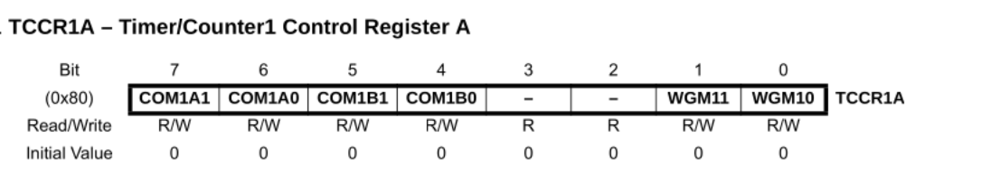
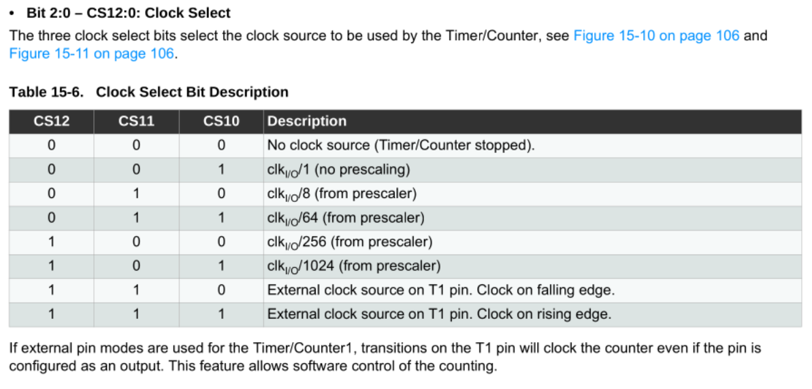
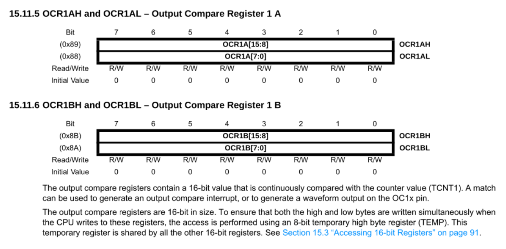
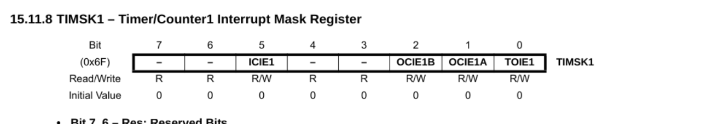
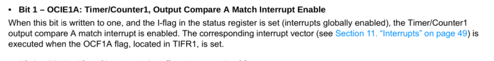
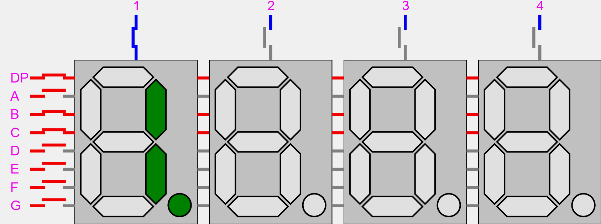
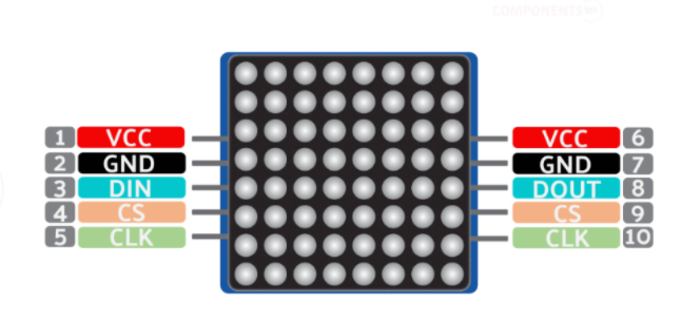

## Table of Contents
1. [Intro - Objective](#intro---objective)
2. [Timer](#timer)  
a. [↳ Do The Math](#do-the-math)  
b. [↳ Registers](#registers)  
c. [↳ Button Debouncing](#button-debouncing)  
3. [MAX7219 LED Display Driver](#max7219-led-display-driver)  
a. [↳ Overview](#overview)  
b. [↳ Registers Map](#registers-map)  
c. [↳ Serial Peripheral Interface (SPI) Protocol](#serial-peripheral-interface-spi-protocol)  
d. [↳ Daisy Chaining](#daisy-chaining)
4. [Show Something](#show-something)  
a. [↳ 8 Digit 7-Segment LED](#8-digit-7-segment-led)  
b. [↳ 8x8 LED Matrix](#8x8-led-matrix)
4. [Result](#result)
5. [Conclusion](#conclusion)
6. [References and Further Reading](#references-and-further-reading)

## Intro - Objective

Pada blog teknikal kali kini, kita akan mencoba menjadikan mikrokontroler ATMega328P sebagai otak dari jam digital. Jam digital akan ditampilkan dalam format 8 digit: `HH.MM.SS.cc` dengan `c` adalah _centiseconds_.

Untuk menampilkan waktu, digunakan modul display 7 segment dengan MAX7219 sebagai drivernya. Selain itu, digunakan pula display matrix 8x8 dengan driver yang sama untuk tantangan semata.

Matrix 8x8 akan menampilkan beberapa emoji/karakter, angka, huruf kapital, dan huruf kecil. Untuk mengganti tampilan, digunakan dua tombol: prev dan next.

Pada jam digital, ditambahkan mekanisme "hold" yang akan menghentikan waktu (display) selama tombol masih ditekan.

Program akan dibahas secara runtut dari program utama timer, debouncing button, hingga interface MAX7219. Kita akan menggunakan beberapa konsep C seperti pointers, reference, dan struct, pastikan Anda telah memahaminya.

## Timer

Secara umum, timer adalah periferal pada mikrokontroler yang berguna untuk menghitung sinyal clock. Timer dSecara umum, timer adalah periferal pada mikrokontroler yang berguna untuk menghitung sinyal clock. Timer dapat dikonfigurasi sedemikian rupa, sehingga perhitungannya dapat digunakan untuk mengukur waktu, delay, dan lain lain.
apat dikonfigurasi sedemikian rupa, sehingga perhitungannya dapat digunakan untuk mengukur waktu, delay, dan lain lain.

Timer bekerja dengan melakukan increment/decrement nilai register setiap beberapa interval. Batas bilangan dan interval dapat dikonfigurasi.

Mikrokontroler ATMega328P dibekali dengan tiga buah timer: timer0 8-bit, timer1 16-bit, dan timer2 8-bit. Kita akan menggunakan timer1 16-bit untuk mengukur waktu dan melakukan button debouncing.

Timer ini memiliki beberapa mode utama: normal, pwm (pulse width modulation), ctc (clear timer compare match). Pada mode ini, timer akan melakukan increment pada register `TCNT1H` dan `TCNT1L`*. Kemudian membandingkan nilai kedua register tersebut dengan register pembanding yang kita konfigurasi.

Ketika nilainya cocok (match), register `TCINT1H` dan `TCINT1L` akan direset ke nilai 0. Jika kita mengaktifkan interrupt, ISR akan dijalankan.

_*Catatan: `TCNTH` untuk byte 8-15 dan `TCNT1L` untuk byte 0-7._

### Do The Math

Unit waktu terkecil pada jam yang akan dibuat adalah 1 centisecond:

$$
  1\text{ s} = 100\text{ cs} = 1,000\text{ ms} = 1,000,000\text{ μs} = 1,000,000,000\text{ ns}
$$
$$
1\text{ cs} = 10\text{ ms} = 10,000\text{ μs} = 10,000,000\text{ ns}
$$

Unit `centiseconds` dijadikan sebagai variable global volatile yang nilainya diincrement setiap 10ms oleh ISR timer 1. Kita perlu mengkonfigurasi timer1 untuk menjalankan ISR setiap 10ms. Sebelum itu, kita hitung terlebih dahulu berapa lama durasi 1 clock cycle.

$$
f_{CPU} = 16\text{ MHz} = 16,000,000\text{ clock cycles/s}
$$
$$
T = \frac{1}{f_{CPU}} = \frac{1}{16,000,000\text{ Hz}} = 62.5\text{ ns/cycle}
$$
$$
\frac{10\text{ ms}}{62.5\text{ ns}} = \frac{10,000,000\text{ ns}}{62.5\text{ ns}} = 160,000\text{ clock cycles}
$$


Butuh 160.000 clock cycle untuk mencapai durasi 10ms jika frekuensi yang digunakan adalah 16MHz. Angka ini terlalu besar untuk timer1 yang hanya 16-bit, \(2^{16} = 65,536\).

Untuk mengatur frekuensi timer ATMega328P, dapat diterapkan sebuah prescale. Yakni membagi frekuensi CPU dengan suatu bilangan. Pada timer 1, frekuensi dapat dibagi dengan \(1, 8, 64, 256,\) atau \(1,024\). 

Perlu diingat bahwa prescale pada timer tidak akan memengaruhi frekuensi utama CPU. Untuk kejelasan, `tick` merepresentasikan 1 clock cycle pada timer, bukan frekuensi utama CPU.


$$
\frac{16\text{ MHz}}{8} = 2\text{ MHz} = 2,000,000\text{ ticks/s} = \frac{2,000,000\text{ ticks}}{1,000,000,000\text{ ns}}
$$
$$
T_{tick} = \frac{1}{2,000,000\text{ Hz}} = 500\text{ ns}
$$
$$
\frac{10\text{ ms}}{500\text{ ns}} = \frac{10,000,000\text{ ns}}{500\text{ ns}} = 20,000\text{ ticks}
$$

Sekarang kita tahu bahwa untuk mencapai 10ms dibutuhkan 20.000 tick timer1, jika frekuensi timer1 dibagi 8. 19.999 (hitung dari 0) akan menjadi nilai pembanding timer1 untuk menjalankan ISR, sehingga ISR dijalankan setiap 10ms.

### Registers




```c
TCCR1B = (1 << 3) | 0b010;
```
`(1 << 3)` akan mengaktifkan mode CTC dengan nilai `OCR1A` sebagai nilai pembanding (Table 15-5). Dan `| 0b010` akan mengaktifkan prescale 8 (Table 15-6).

Setelah timer 1 dikonfigurasi, kita masih perlu membandingkan nilai `TCINT1` dengan `19999`.



`OCR1A` atau `OCR1B` cocok dengan kebutuhan kita. Untuk mengaktifkan interrupt ketika nilai `OCR1A` dan `TCINT1` cocok, register `TIMSK` harus diubah.



```c
int main()
{
  // ...
  TCCR1B = (1 << 3) | 0b010; // ctc mode, presale 8 (2 MHz)
  OCR1A = 19999; // 10ms each match
  TIMSK1 |= (1 << OCIE1A); // Enable compare match A interrupt
  // ...
}
```

Dengan konfigurasi timer di atas, sinyal interrupt vector TIMER1_COMPA akan dihasilkan setiap 10ms. Di dalam ISR kita dapat melakukan increment variabel `centiseconds`, dan mengaktifkan flag `update_display`.

Flag `update_display` digunakan agar driver tidak terlalu banyak bekerja. Frekuensi maksimal yang dapat ditanggung IC `MAX7219` adalah 800Hz. Dengan update setiap 10ms, maka frekuensinya adalah 100Hz. 
```c
volatile uint32_t centiseconds = 0;
volatile bool count = true;
volatile bool update_display = true;

ISR (TIMER1_COMPA_vect) 
{
  if (count) {
    centiseconds++;
    update_display = true;
  }
  // ...
}
```

Variabel boolean `count` ditentukan oleh sebuah tombol, ketika ditahan nilainya false. Terdapat dua tombol lain `prev` dan `next`, yang  berfungsi untuk mengganti tampilan matrix 8x8.

Alih-alih menggunakan PCINT (Pin Change Interrupt) atau EINT (External Interrupt), kita akan menggunakan ISR yang sudah ada.
### Button Debouncing

Pada program sebelumnya, kita menggunakan `_delay_ms(25)` di dalam ISR untuk melakukan debouncing pada sebuah tombol. Namun, ISR harus diselesaikan dalam clock cycle seminimal mungkin. Fungsi delay melanggar aturan tersebut.

> Generally it is never recommended to use a delay routine inside the
ISR. ~AVR1200: Using External Interrupts for megaAVR
Devices, ATMEL Application Notes

Sebagai alternatif, kita dapat menggunakan ISR timer yang sudah kita buat untuk mengecek keadaan tiga tombol setiap 10ms. 

```c
#define BUTTON_COUNT 3

typedef struct 
{
  uint8_t *inputreg;
  uint8_t pin_no;
  bool last_state;
  uint8_t delay;
  bool event;
} button_t;

volatile button_t hold; // PD2
volatile button_t next; // PD6
volatile button_t prev; // PD7

volatile button_t *buttons[BUTTON_COUNT] = {
  &hold,
  &next,
  &prev
};

button_t init_button(uint8_t *inputreg, char pin_no)
{
  button_t temp;
  temp.inputreg = inputreg;
  temp.pin_no = pin_no;
  temp.last_state = ((*inputreg) >> pin_no) & 1;
  temp.delay = 0;
  temp.event = false;
  return temp;
}
```

Karena ketiga tombol memiliki karakteristik/parameter yang sama, kita dapat memanfaatkan struct. 

Array `*buttons` akan diiterasi di dalam ISR. Masing-masing elemen array tersebut menunjuk ke alamat memori sebuah struct `button_t`.

```c
int main()
{
  //...
  hold = init_button(&PIND, PD2);
  next = init_button(&PIND, PD6);
  prev = init_button(&PIND, PD7);

  PORTD = (1 << hold.pin_no) | (1 << next.pin_no) | (1 << prev.pin_no);
  //...
}
```
Pemanggilan fungsi `init_button` di dalam main akan menginisialisasi struct `button_t`. Ketiga tombol di atas merupakan pull-up button, sehingga nilai `last_state` adalah 1, dan kita perlu memberi nilai HIGH pada `PORTD`.

Karena alamat ketiga variabel di atas disimpan dalam sebuah array, kita dapat menggunakan `for` loop di dalam ISR untuk mengecek keadaan setiap tombol:
```c
#define DEBOUNCE_DELAY 3
ISR (TIMER1_COMPA_vect) 
{
  if (count) {
    centiseconds++;
    update_display = true;
  }

  for (int i=0; i<BUTTON_COUNT; i++) {
    bool current_state = (*(buttons[i]->inputreg) >> buttons[i]->pin_no) & 1;

    if (current_state != buttons[i]->last_state) {
      if (buttons[i]->delay>=DEBOUNCE_DELAY) {
        buttons[i]->event = true;
        buttons[i]->last_state = current_state;
        buttons[i]->delay = 0;
      } else {
        buttons[i]->delay++;
      }
      update_display = true;
    } else {
      buttons[i]->delay = 0;
    }
  }
}
```
Di setiap iterasinya, jika kondisi tombol saat ini berbeda dengan kondisi terakhir, nilai member `delay` akan di-increment. Ini akan terjadi sebanyak tiga kali setiap ISR dijalankan, yakni setiap 10ms.
Dengan begitu, durasi total debounce adalah 30ms.

Setelah nilai `delay` >= 3, flag `event` akan diaktifkan, keadaan terakhir diperbarui, dan `delay` diulang ke 0. Flag `event` nantinya digunakan pada _main loop_ untuk menjalankan aksi yang diperlukan.

```c
extern uint8_t IMAGES_LEN;
volatile int c = 0;

int main() 
{
  // ...
  while (1) {
    // ...
    if (hold.event) {
      if ((*(hold.inputreg) >> hold.pin_no) & 1) {
        count = true;
      } else {
        count = false;
      }
      hold.event = false;
    }

    if (next.event) {
      if (!((*(next.inputreg) >> next.pin_no) & 1)) {
        if (c==(IMAGES_LEN-1)) {
          c = 0;
        } else {
          c++;
        }
      }
      next.event = false;
    }

    if (prev.event) {
      if (!((*(prev.inputreg) >> prev.pin_no) & 1)) {
        if (c) {
          c--;
        } else {
          c = IMAGES_LEN-1;
        }
      }
      prev.event = false;
    }
  }
}
```
Tidak lupa, setelah aksi, member `event` dikembalikan ke nilai `false`.

Sistem debounce di atas tidak menggunakan fungsi _blocking_ `_delay_ms` yang akan memblokir semua proses dalam periode tertentu. Alih-alih, ISR timer yang sudah dikonfigurasi digunakan untuk mengecek keadaan masing-masing tombol dan melakukan delay _non-blocking_. Karena merupakan proses _non-blocking_, display waktu tidak akan terhambat oleh proses debounce.

## MAX7219 LED Display Driver


> The MAX7219/MAX7221 are compact, serial input/
output common-cathode display drivers that interface
microprocessors (μPs) to 7-segment numeric LED
displays of up to 8 digits, bar-graph displays, or 64 individual
LEDs. Included on-chip are a BCD code-B decoder,
multiplex scan circuitry, segment and digit drivers, and
an 8x8 static RAM that stores each digit. Only one
external resistor is required to set the segment current for
all LEDs. ~MAX7219/MAX7221 Datasheet

### Overview

Kita akan menggunakan modul 7-segment untuk menampilkan waktu, dan modul 8x8 matrix untuk menampilkan karakter.

Pada modul 7-segment 8 digit, terdapat 8 LED untuk masing-masing digit (termasuk titik), \(8 × 8 = 64\). Modul display 8x8 matrix juga memiliki jumlah LED yang sama, 64. Total, terdapat 128 LED yang perlu dikendalikan. Jumlah yang terlalu banyak jika hanya dikendalikan oleh ATMega328P.

Oleh karena itu, IC MAX7219 digunakan sebagai _display driver_. Satu unit IC ini dapat mengendalikan 8 digit 7 segment, atau 64 LED. IC ini bekerja menggunakan teknik multiplexing. Yakni mengendalikan satu digit dalam satu waktu, dan beralih ke digit lainnya dengan sangat cepat sehingga tercipta ilusi bahwa semua digit tampil secara bersamaan.



Untuk alasan kemudahan, kita menggunakan modul display yang sudah tertanam IC MAX7219.

### Pinout Description



Karena kedua modul menggunakan IC yang sama, pinout kedua modul juga memiliki kesamaan. Di sebelah kiri adalah in, sebalah kanan out.  

Pin `DIN` dan `CLK` digunakan untuk protokol komunikasi _Serial Peripheral Interface (SPI)_. Pin `CS` akan memperbarui display ketika diberi sinyal _rising edge_.

Sinyal output di sebelah kanan berguna untuk merantai (_daisy chaining_) beberapa modul display. Contoh, `DOUT` dari modul A disambungkan ke `DIN` dari modul B. Dengan ini, jumlah pin yang terhubung ke MCU tetaplah sama.

Modul yang dirantai tidak harus memiliki jenis tampilan yang seragam, selama IC yang digunakan sama, MAX7219. Pada kasus kita, modul 7-segment 8 digit akan dihubungkan ke MCU, dan `DOUT` dari modul tersebut dirantai ke modul 8x8 matrix.

### Serial Peripheral Interface (SPI) Protocol
### Registers Map
### Daisy Chaining
## Show Something
### 8 Digit 7-Segment LED
### 8x8 LED Matrix
## Result
## Conclusion
## References and Further Reading
* GitHub: [vfadlan/avr-exp/08-max7219-timer](https://github.com/vfadlan/avr-exp/tree/main/08-max7219-timer)
* [ATMega328P Datasheet](https://ww1.microchip.com/downloads/en/DeviceDoc/Atmel-7810-Automotive-Microcontrollers-ATmega328P_Datasheet.pdf)
* [MAX7219 Driver Datasheet]
* [AVR1200: Using External Interrupts for megaAVR
Devices]